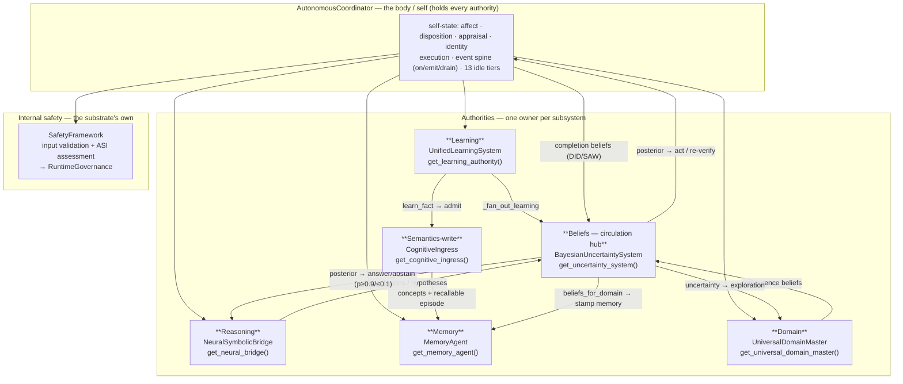

# TorinAI — Architecture

*The canonical architecture document. Verified against the running system
(`experiments/systems/VERIFY-01`). This master holds the conceptual model, the subsystem
diagram, the authority map, and the belief circulation; the **exhaustive method-by-method
reference for every subsystem** lives in [`docs/architecture/`](architecture/) (linked per
faculty below). Living document — update it (and the diagram / belief I/O) whenever a
subsystem, method, or wiring changes. Supersedes `ARCHITECTURE_GRAPH.md` and
`AUTONOMOUS_COORDINATOR_MAP.md`; the terse name+line inventory is `SUBSTRATE_SYSTEMS_MAP.md`.*

---

## 1. What TorinAI is

TorinAI is a **persistent cognitive substrate**: a system that maintains and develops
structured knowledge, memory, beliefs, learned operators, competence, and goals over time,
and reasons over what it holds rather than regenerating an answer from scratch. Cognition is
**one body** — not a bus between independent services. Each faculty is an **subsystem that does
one thing**, owned by exactly one authority, and the **coordinator is the body** that holds
every authority. The output of one subsystem becomes structured input to another: a conclusion
revises a belief, an action produces an experience, an experience induces an operator, a
competence gap raises the motivation to explore.

> **Language models.** TorinAI's cognition uses no language model. Reasoning, learning,
> planning, action, and verification consult none. The only component that can consult a
> model at all is a single teaching module (`core/learning/teacher_policy.py`), essentially
> unused — remove it and the substrate is unchanged.

---

## 2. The body — Module authorities, and the belief circulation

**One owner per subsystem; the coordinator holds them all.** A snapshot of the running
system is *one coherent entity with one state*, not a service mesh.



### Authority accessors
| Module | Authority (accessor) | File | Reference |
|---|---|---|---|
| Learning | `UnifiedLearningSystem` — `get_learning_authority()` | `core/learning/unified_learning_system.py` | [learning.md](architecture/learning.md) |
| Reasoning | `NeuralSymbolicBridge` — `get_neural_bridge()` | `core/reasoning/neural_bridge.py` | [reasoning.md](architecture/reasoning.md) |
| Memory | `MemoryAgent` — `get_memory_agent()` (async) | `core/agents/memory_agent.py` | [memory.md](architecture/memory.md) |
| Beliefs | `BayesianUncertaintySystem` — `get_uncertainty_system()` | `core/reasoning/bayesian_uncertainty.py` | [beliefs.md](architecture/beliefs.md) |
| Domain | `UniversalDomainMaster` — `get_universal_domain_master()` | `core/integration/universal_domain_master.py` | [domain.md](architecture/domain.md) |
| Semantics-write | `CognitiveIngress` — `get_cognitive_ingress()` | `core/semantics/cognitive_ingress.py` | [semantics-ingress.md](architecture/semantics-ingress.md) |
| Internal safety | `SafetyFramework` — `get_safety_framework()` | `core/security/safety_framework.py` | [security.md](architecture/security.md) |
| Body / control plane | `AutonomousCoordinator` — `get_autonomous_coordinator()` | `core/agents/autonomous/autonomous_coordinator.py` | [coordinator.md](architecture/coordinator.md) |

### The belief circulation (feeders → hub → consumers)
Beliefs are the blood: one artery in (the fan-out door), a bounded set of tissues perfused.
- **Feeders (move a posterior — all via `observe_claim`/`create_belief`/`update_belief`):**
  teaching + perception (`_fan_out_learning`, `evidence_producers`→`fan_out_ingested`),
  reasoning conclusions (`epistemic_engine`, `hypothesis_testing`, `abstract_reasoning`,
  `hierarchical_abstraction`), competence (`UniversalDomainMaster`), task completion (the
  coordinator's DID/SAW belief).
- **Consumers (read a posterior to act):** task completion (`_decide_completion`) and
  perception act-vs-verify (`perceive`, which emits `PERCEPT_RECOGNIZED`) in the
  coordinator; reasoning answer/abstain (`neural_bridge`, p≥0.9/≤0.1); exploration
  (`intrinsic_motivation`); memory stamping — each memory records the live
  `belief_state`, the appraisal self-state, AND (recency-gated) the `perceptual_state`,
  so a recalled memory carries what was perceived + believed + felt at that moment.

### Knowledge → emotion (and the decision invariant)
Belief movement is also what the substrate *feels*. The **reasoning authority** owns the
interpretation: `NeuralSymbolicBridge.epistemic_affect_signal()` reads how the belief
graph moved since last asked — from **any** source (perception, teaching, reasoning),
via `EpistemicEngine.interpret_drift()`, a read-only diff — and summarizes it into the
emotional dials (`uncertainty_reduction` → confidence ↑; `uncertainty_increase`/
`contradiction` → doubt + curiosity ↑). The coordinator (the body) relays that signal to
the appraisal authority; it interprets nothing itself. No subsystem special-cases itself into
emotion — they all feed it by moving beliefs.

**The invariant:** emotion may shape **disposition** (how cautious, how much to verify,
what to attend to) and may color beliefs — but **in a core decision it has no vote.** A
decision is *evidence vs. a bar*; emotion can set the bar (disposition), never substitute
for the evidence. `perceive`/`_decide_completion` embody this: the accept bar is
disposition-derived (appraisal), the decision itself is `posterior ≥ bar`. The substrate
always takes the most logical path; feeling changes how hard it looks, not what it concludes.

### Resilience in a single-subsystem body
There are no spare hearts (redundancy is the duplicate-authority anti-pattern). Robustness
comes from three substitutes: **honest distress signalling** (`raise_if_structural` — a
broken subsystem re-raises instead of masking a "0 done"), **failure isolation** (one subsystem's
fault must not cascade), and **homeostasis** (the health/recovery event loop detects distress
and heals). The nervous path (the coordinator's hot loop) must never block.

---

## 3. Persistent cognitive state

The shared, durable state every subsystem reads and writes. Each element has a single authority.

| Element | What it is | Store |
|---|---|---|
| **Concepts** | typed nodes of what the system knows | `unified.concepts` |
| **Relations** | typed, polarity-bearing edges (is-a, part-of, denials) | `unified.concept_relations` |
| **Memory** | retained experiences, retrievable and consolidated | memory tiers (`MemoryAgent`) |
| **Beliefs** | propositions held with calibrated, revisable uncertainty | `unified.beliefs` |
| **Operators** | learned, variable-carrying transformations with add/remove effects | `unified.learned_rules` |
| **Competence** | per-subject estimate of what the system can *do* | competence beliefs (UDM) |
| **Domains** | subjects — clusters of concepts and operators, created automatically | `unified.domains` |
| **Experience** | before/action/after traces that feed learning | `unified.operator_demonstrations` |

The elements form a cycle: experience → memory → learning → (operators, concepts, beliefs) →
reasoning → planning → action → experience.

---

## 4. The faculties (one subsystem each, all held by the coordinator)

Each links to its exhaustive method reference.

- **Reasoning** — [`architecture/reasoning.md`](architecture/reasoning.md). `coord.reason_about(q)`
  → `NeuralSymbolicBridge.reason`. Substrate-first, no model fallback: substrate solvers
  (taxonomy, concept graph, held/induced rules, symbolic, equation, sequence), the eleven
  kinds, and the named modes. Returns `unsupported` rather than guessing; diagnoses gaps.
- **Learning** — [`architecture/learning.md`](architecture/learning.md). The one learning
  authority (`coord.learning`): instruction fan-out, operator induction (off the acting
  path), consolidation, and the belief door. Perception classifiers are owned here.
- **Memory** — [`architecture/memory.md`](architecture/memory.md). `MemoryAgent`
  (`coord.memory`): worthiness-gated write, type inference, recall, consolidation/abstraction,
  tiering, governed parameter changes.
- **Beliefs** — [`architecture/beliefs.md`](architecture/beliefs.md). The circulation hub;
  find-or-create-by-claim, graded/revisable posteriors, constraint propagation, decay.
- **Domain** — [`architecture/domain.md`](architecture/domain.md). `UniversalDomainMaster`:
  domain existence, competence/controllability, crystallization, cross-domain transfer.
- **Semantics-write** — [`architecture/semantics-ingress.md`](architecture/semantics-ingress.md).
  `CognitiveIngress`: the one door knowledge comes through (admit → concepts + aliases +
  evidence + memory), with the `MIN_ADMIT_QUALITY` floor.
- **Perception** — the one sensory pipeline. `coord.see(path)` *senses* (classical CV, no
  model) and routes the structure through `PerceptionManager.process_input`, the **sole
  admitter** — every modality (vision, sensors) admitted once, through one owner.
  `coord.perceive(classifier, instance, id)` recognizes and lets the recognition's
  posterior govern behaviour through the **same acceptance band as completion**, emitting
  `PERCEPT_RECOGNIZED` → `_react_percept` (ACT stands; VERIFY → known-unknown; ABSTAIN
  nothing). A percept is a belief **feeder**, and each memory stamps the contemporaneous
  `perceptual_state` so a recalled memory holds what was perceived *and* believed *and*
  felt. A percept also **feeds the emotional state** — not by a perception-specific hook,
  but because a percept moves beliefs, and belief movement is read by the epistemic
  channel (below) like movement from any other source.
- **Security** — [`architecture/security.md`](architecture/security.md). The substrate's internal
  safety (`SafetyFramework`); world/DHCM security lives in the world's factory, outside TorinAI.
- **The body / coordinator** — [`architecture/coordinator.md`](architecture/coordinator.md).
  Holds every authority; execution faculty (`execute_task`), the self (`state`/`render`/
  `disposition`), grounded completion (`_derive_completion_anchor`→`_decide_completion`, DID+SAW),
  the event spine + reactions, and the idle tiers. The substrate never modifies itself: it has no
  model weights and never rewrites its code or configuration — it improves only by learning.

---

## 5. Cross-faculty loops

- **Experience → learning:** action → outcome → experience → operators/knowledge → next plan.
- **Completion:** action → DID + independent SAW → completion belief → done / recovery.
- **Intrinsic learning:** competence gap → epistemic uncertainty → exploration target →
  experience → competence update → uncertainty falls.

Each loop crosses several subsystems; removing any one breaks it. That is what makes the substrate
one body rather than co-resident parts.

---

## 6. Coordination and standing operation

- **One coordinator, one shared state.** One authority per state kind.
- **Reactive event spine:** `on` / `emit` / `_reactive_drain_worker`; reactions (`_react_*`)
  let one subsystem's outcome wake another (a demonstration triggers induction, an admitted fact
  triggers domain crystallisation, a health event triggers recovery).
- **Standing background tiers** (13, one scheduler, `_register_idle_subsystems`): security,
  health & recovery, system review, knowledge refresh, self-improvement, meta-learning, memory
  consolidation, self-optimisation, domain expansion/discovery, operator exploration/induction,
  analogy discovery — plus a constitutional self-check.

---

## 7. Running it

Canonical runtime: `./venv_torin/bin/python3` (Python 3.11). Postgres at `127.0.0.1:5433`,
database `torinai_db`.

```python
from core.main import get_system
system = get_system(); await system.initialize()
coord = system.autonomous_coordinator
```

Environment: `PYTHONPATH="$PWD"`, `POSTGRES_PORT=5433`, `TORIN_NO_WATCHDOG=1`.

---

## 8. Repository layout & verification

- `core/` — the substrate: `agents/autonomous` (the coordinator), `reasoning`, `learning`,
  `memory`, `execution`, `domain`, `integration`, `semantics`, `governance`, `security`,
  `health`, `tools`.
- `docs/` — root holds only this file + `README.md`; everything else is categorized in
  subfolders: `architecture/` (per-subsystem method references + `SUBSTRATE_SYSTEMS_MAP.md`,
  the terse inventory + seam/honesty audit), `design/` (internal design notes), `research/`
  (`LAB_NOTEBOOK.md` the scientific record, `RESEARCH_OOD_ABSTENTION.md`, theses, papers),
  `security/`, `audits/`, `governance/`, `teaching_sessions/`, `archive/`.
- `experiments/` — reproducible studies (`experiment.py` + `manifest.json` + `README.md`);
  `systems/VERIFY-01` exercises reasoning, execution, cross-domain, domain, learning+beliefs,
  intrinsic motivation, and memory live, model-free where a model is not the point.
- `tests/` — by subsystem.
