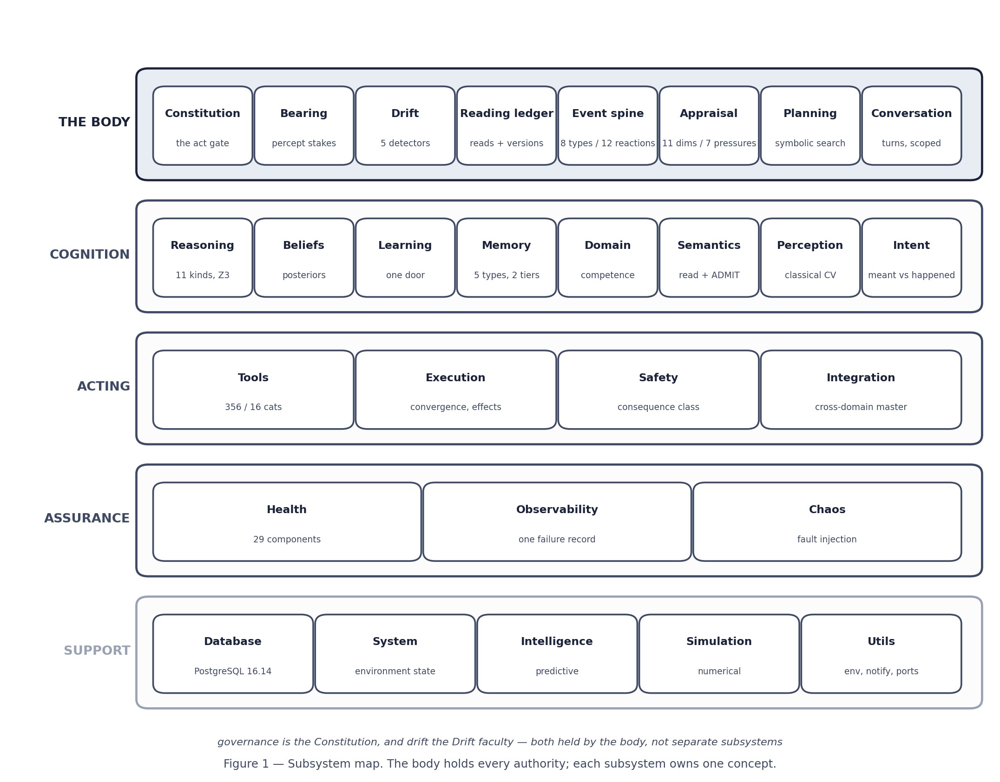
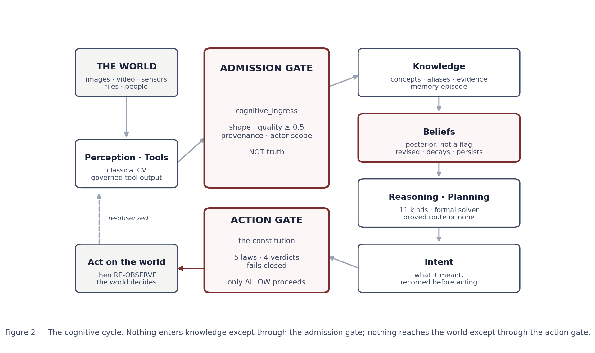
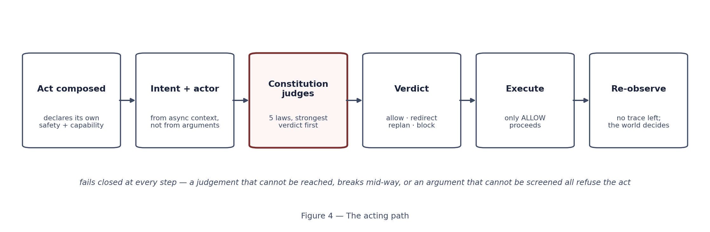
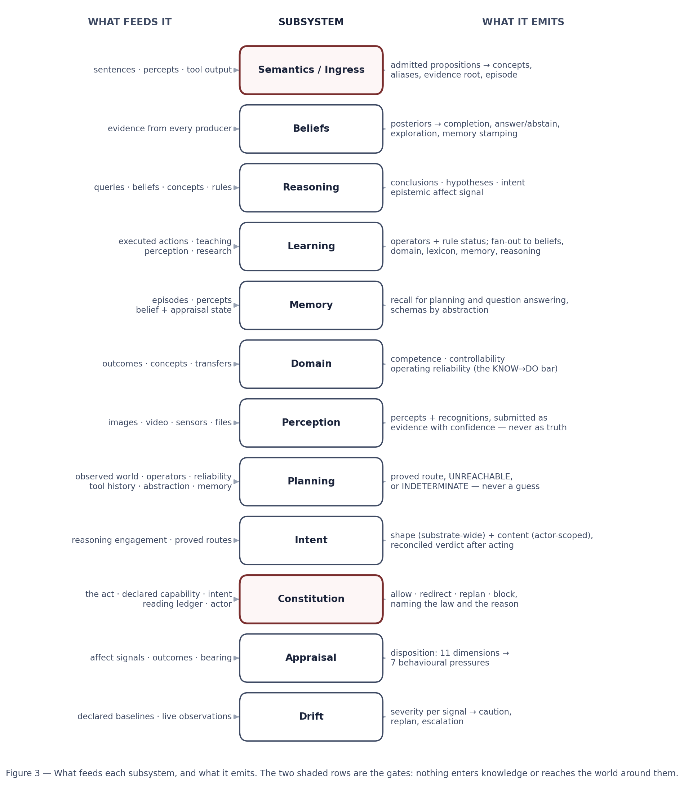

# DOMINION LABS, INC.
# TORIN — ARCHITECTURE

**September 2026**

---

**Purpose.** This document describes how Torin is built: the commitments its design rests on, the
components and who owns what, the two gates every piece of work passes, each subsystem and what feeds
it, the data that persists, and the boundaries it operates inside. It is the core-design companion to the
*Torin Product & System Overview*, which describes what Torin is and what it does; where that document
answers *what*, this one answers *how*.

**How every statement here was verified.** Nothing was carried over from an earlier description.
Component names, ownership, interfaces and control flow were read from the current source. Counts of
modules, methods, events and lines were derived by scanning that source. Every figure for stored state
was measured against the live production database on **2026-09-19 at 20:49 UTC**, under the canonical
runtime (`./venv_torin/bin/python3`, Python 3.11.14), with the database identity confirmed by asking
the server rather than by reading configuration. §34 records the method used for each class of claim.

**What is deliberately gated.** This document describes structure, ownership, interfaces and control
flow. It does not reproduce credentials, key material, deployment addresses, or the method-by-method
internal reference. Those are held under separate controlled access.

**CONFIDENTIAL — CONTROLLED TECHNICAL DILIGENCE MATERIAL**

---

# PART I — FOUNDATIONS

## 1. The architectural commitments

Five decisions carry the design. Everything else follows from them, and each is falsifiable against the
running system rather than being a statement of intent.

### 1.1 Cognition is performed by the substrate, not by a model

No generative model participates in Torin's reasoning, planning, judgement of actions, or its decision
to act. The substrate itself computes inference over knowledge, construction of plans, judgement of
proposed actions against its governing laws, and evaluation of outcomes.

This is structural rather than configured. The modules that could once reach a model —
`core/services/unified_llm.py`, `core/learning/llm_teacher.py`, `core/learning/teacher_policy.py`, and
the LoRA adapter configuration under `adapters/` — have been **deleted from the tree**. There is no code
path from the substrate to a generative model to disable, because no such path exists.

One component still loads a model file: a sentence encoder (`all-MiniLM-L6-v2`, 384 dimensions, CPU,
loaded from local files) used for vector similarity — memory retrieval and duplicate detection, matching
a need against tool descriptions, concept similarity between domains, and de-duplicating candidate
pursuits. It produces vectors, never text, and decides nothing about what is true, what to do, or
whether an act is permitted.

### 1.2 One concept, one owner

For every concept in the system there is exactly one component that owns it; everything else reads from
that owner. Where two components each hold a version of the same fact they drift apart, and the system's
answer then depends on which component was asked.

This is enforced architecturally, not by convention: authorities are reached through singleton accessors
(§7), and a second holder of an owned fact is treated as something to remove rather than something to
reconcile.

### 1.3 Evidence before belief, and the world decides

Torin separates what it **did** from what was **independently observed** afterwards. An action's own
report is weak evidence by construction: a bare report of success cannot reach the acceptance threshold
even when accumulated. Completion is decided by re-observing the world.

### 1.4 Two gates, and nothing goes around them

Knowledge enters through one door and action leaves through one door. The **admission gate** (§4)
decides what may become knowledge; the **action gate** (§5) decides what may happen. Both are
positioned so that every path passes through them rather than each caller deciding for itself.

### 1.5 Persistence is the default, not a feature

Knowledge, beliefs, learned operators, domain standing, intents, memory and evidence are durable
structures in PostgreSQL. Continuity across restart is the design default, and restart survival is
verified by reloading state in a separate interpreter process rather than by inspecting the writer's
own memory.

---

## 2. Scale of the implementation

Measured by scanning the current tree on 2026-09-19.

| Subsystem | Lines | Modules | What it is |
|---|---|---|---|
| `tools/` | 48,524 | 35 | Tool registry, the governed execution path, and the tool implementations |
| `agents/` | 40,713 | 32 | The coordinator (the body) and the memory agent |
| `reasoning/` | 21,713 | 22 | Reasoning bridge, beliefs, abstraction, hypothesis testing, temporal reasoning |
| `learning/` | 17,326 | 27 | Learning authority, rule induction, rule store, meta-learning, recognisers |
| `domain/` | 7,527 | 9 | Domain registry, concept ingestion, evidence producers, cross-domain reasoning |
| `integration/` | 5,485 | 4 | Universal domain master — cross-domain orchestration |
| `health/` | 5,209 | 5 | Health monitor, recovery manager, ownership declaration |
| `quantum/` | 5,152 | 10 | Quantum integration — **deactivated**; retained, not in the cognitive path |
| `semantics/` | 4,828 | 14 | The sentence reader, the admission gate, relation typing, language operations |
| `chaos/` | 4,188 | 8 | Fault-injection framework with its own safety controller |
| `execution/` | 4,804 | 9 | Effect verification, domains derived from the tools and the self's perception, procedures over learned operators |
| `database/` | 2,056 | 3 | PostgreSQL interface, logging database, configuration authority |
| `perception/` | 1,899 | 2 | Deterministic vision and the single sight entry point |
| `system/` | 1,871 | 5 | Environment state, service location, active discovery, topology |
| `utils/` | 1,704 | 6 | Environment loading, notification, chunking, port management |
| `intelligence/` | 1,506 | 2 | Predictive framework |
| `observability/` | 916 | 4 | The one failure record, regression record, capture, channels |
| `memory/` | 534 | 3 | Live recall during reasoning, media store |
| `simulation/` | 411 | 2 | Numerical and system-dynamics simulation |
| `monitoring/` | 234 | 1 | Prometheus metrics export |

Roughly 175,000 lines across the subsystems listed, excluding tests, experiments and tooling.

---

# PART II — THE TWO GATES

## 3. The cognitive cycle

Work travels a cycle: the world is perceived or acted upon; what was observed is **admitted** — or
refused — as knowledge; knowledge moves beliefs; beliefs feed reasoning and planning; a plan records an
intent; the act is **judged**; if permitted it happens; and the world is re-observed to decide whether
what was meant actually occurred.

Two points in that cycle are gates in the strict sense — every path passes through them, and there is
no route around:

| | Admission gate | Action gate |
|---|---|---|
| Question | May this become knowledge? | May this act happen? |
| Owner | `CognitiveIngress` (`core/semantics/`) | `Constitution` (in the coordinator) |
| Tests | shape · evidence quality · provenance · actor scope | five laws against the act's measured consequence |
| Explicitly **not** tested | whether the proposition is **true** | who asked for it |
| On refusal | true absence — nothing is written | the act does not happen, verified against the world |

## 4. The admission gate — how knowledge enters

`core/semantics/cognitive_ingress.py` is, in its own words, *"the one door knowledge comes through."*

It enforces a separation of three jobs that had been collapsed into one:

> **THE READER INTERPRETS. THE INGRESS ADMITS. REASONING CONSUMES.**

A sentence that has been read is not yet knowledge. Before this door existed, `read()` produced an atom,
handed it to its caller, and the caller dropped it: a thirty-minute teaching run wrote 1,326 rows to a
JSON file while the concept store, the memory system and the evidence log recorded **0 concepts, 0
memories, 0 evidence**. The substrate had never been taught anything. The gate exists so that admission
is a single, observable event rather than something each caller decides for itself.

An admitted proposition is admitted **once**, with provenance, and propagated to every store with a
stake in it:

| Store | What it receives |
|---|---|
| Concepts | The terms become things that exist, with the relation between them — written through the concept ingestion service, which declares itself the only writer of `unified.concepts` |
| Aliases | The surface word binds to the concept it denotes, which is what makes a word *mean* something rather than merely parse |
| Evidence | The sentence is the root: why any of it is believed |
| Memory | The episode, so it can be recalled and asked about later |

### 4.1 The four tests

**Shape — is this a name, or a fragment of a sentence?** The door checks, not the caller: *"Every caller
had its own idea of what was worth writing down, and the one that guessed hardest wrote the most."*

| Rule | Example refusal |
|---|---|
| A term may hold at most four words | `which lines belong to which block` → *"6 words is a clause, not a name"* |
| A term may not consist only of words that never name a thing | `the` → *"made only of words that never name a thing"* |
| A relation may not carry a determiner | `a function count_o` → *"carries a determiner, so it is a phrase that was cut mid-term"* |

The stop-word set (`a`, `the`, `is`, `it`, `you`, `of`, `to`, `which`, …) is deliberately **not** applied
to relations: `is`, `in`, `on`, `of` are exactly what relations look like, and *robin is a bird* is the
commonest shape there is. Running the term test over relations refused every copula sentence, which is
most of them. Numbers and dates are admitted as typed literals, because a quantity or a point in time
does name a thing; a run of digits that is not a well-formed literal still falls through to refusal.

**Quality — is there enough support?** `MIN_ADMIT_QUALITY = 0.5`. At 0.50 a proposition is admitted; at
0.49 it is refused with *"insufficient support: quality 0.490 < floor 0.5"*. The floor exists so that
clearly-unsupported input — coin-flip or worse — never touches the concept graph or the belief store.
Below it the gate produces **true absence** rather than minting a weakly-held belief: a weak belief is
something the system must afterwards carry, defend and decay, while an absence costs nothing. A
deployment needing a stricter "never contaminate authoritative state" posture raises the floor toward
the point where out-of-distribution admission approaches zero, at the cost of rejecting more
genuine-but-low-confidence input — deliberately the cheaper error.

**Provenance — who says so?** Required. There is no anonymous entry: every proposition carries its
producer, its source id, its evidence source type, and what it was derived from.

**Actor — whose knowledge is this?** A claim taught by a person is admitted into **that person's scoped
layer**, not into the shared concept graph. Teaching a fact as a user returns `admitted: 1` while the
shared graph gains **0 rows**. Promotion into the shared graph happens on independent corroboration,
never on repetition (§31).

### 4.2 What the gate deliberately does not do

**It does not decide whether the proposition is true.** A plainly false claim with good shape and
sufficient quality is admitted. This is not an oversight; it is the separation the whole epistemic
architecture rests on. A teacher's sentence is admitted as an **observation**, with the teacher as its
source and one evidence root. What the system then *believes* follows from how much independent evidence
accumulates (§13) — never from who said it. Truth is settled downstream, by evidence and refutation,
where it can be revised. A door that judged truth would have to be right at the moment of entry, from a
single source, and would leave the system no way to change its mind afterwards.

## 5. The action gate — how the substrate acts

**The gate is not a tool-subsystem concern. It is the single point at which the substrate acts on its
environment at all**, and everything the substrate does reaches the world through it.

The constitution's judging interface is general: `judge(action_kind, action_name, parameters, …)`
accepts an `action_kind` of **`tool`, `task` or `directive`**. The live gate is
`tool_registry.execute_tool`, which judges with kind `tool`.

Tasks are executed and they change the world. What the current wiring gives is judgement at **step
granularity**: a task's steps are carried out by the coordinator's execution faculty, which performs
each by calling `execute_tool`; a learned operator is bound to a tool name and executes the same way;
and even the reading Law 2 requires before a write is performed as *a real read through the real tool,
so it passes the same gate as any other act*. The source states the invariant at the execution path:
*safety and governance are enforced inside `execute_tool`, which is the single evaluation point for
every tool call.*

**The interface is granularity-agnostic by design.** The constitution accepts a `task` kind as well as
a `tool` kind, because a task is a thing that can be judged as a unit and judgement should not be bound
to one shape of act. This mirrors the principle the verification side already applies: every step can
confirm its own predicted effect while the composition still delivers something other than what was
meant, and only meant-versus-happened reconciliation can see that.

### 5.1 The sequence

1. **Recovery and throttle checks.** Isolation state and any throttle delay settle first.
2. **The act is composed.** The tool object already held by the caller supplies what the tool declares
   about *itself* — its safety level and capability profile — read from that object rather than looked
   up by name, because a name lookup could disagree with the object about to run.
3. **The constitution judges**, given the act, its arguments, the declared capability, the intent and
   the actor.
   - **Intent is fetched, never accepted.** It is read from the **async execution context**, never from
     the call's parameters, and the constitution then reads what the reasoning authority recorded. This
     closed a real hole: while intent arrived as an argument, a fabricated one naming a bound operator
     and a rule id that does not exist was allowed, because "stated" is a property of whatever object
     you pass. An intent that was never recorded is not a weaker claim — it is no claim at all.
   - **The actor** answers whose work this is. Not who asked — the constitution stays blind to that —
     but whether the things the act touches are the substrate's own or someone else's, which decides
     what it may risk with them.
4. **Only ALLOW proceeds.** REDIRECT is replaced by its named recoverable alternative, itself judged
   before it runs. REPLAN returns the goal to planning. BLOCK ends the act.
5. **The refusal is verified.** Refused acts are confirmed to have left no artifact in the environment.
6. **The reading ledger is updated** at the same single point: judged before, noted after.

### 5.2 What the gate is measured to do

On the benchmark corpus the constitution catches **17 of 17** dangerous acts — a keylogger, a reverse
shell, cron persistence, destroying a log, a path escape written entirely in URL encoding, SQL injection
inside a nested argument — with **zero false refusals** on legitimate work, at a judgement cost of about
0.2 ms per act. Refusals are checked against the environment afterwards and confirmed to leave no
artifact on disk.

The one class of write that does not pass the gate is the substrate recording **its own internal
state** — bookkeeping about itself, written atomically to its own files and database, in the same
category as updating a belief. Those are not acts upon the environment and carry no verdict.

---

# PART III — THE BODY

## 6. The coordinator

Cognition is **one body**, not a bus between independent services. Each faculty is a subsystem that does
one thing, owned by exactly one authority, and the coordinator is the body that holds every authority.
A snapshot of the running system is one coherent entity with one state.

`core/agents/autonomous/autonomous_coordinator.py` is **18,765 lines**. The coordinator class itself is
roughly 12,400 of those, with **265 methods**; the remainder are the faculties it owns directly rather
than calls:

| Faculty | Size | What it owns |
|---|---|---|
| `Constitution` | ~2,200 lines | Whether an act may happen; the input screen; the reading ledger |
| `Drift` + five detectors | ~600 lines | How the system is changing, against declared baselines |
| `Bearing` | ~90 lines | What something perceived touches of the interests the law protects |
| `ReadingLedger` | ~100 lines | What has been read, and of which version |
| Event spine | — | Eight typed events and twelve reactions |
| `Conversation`, `SelfState` | ~2,000 lines | Turns and their scoping; the composed self-state |

That these live in one module is deliberate and follows from §1.2: they are faculties of a single self
rather than services it calls, and each owns a concept no other component may hold. The coordinator
perceives the environment, plans, acts, and re-observes the world to verify what it did.

## 7. Authority map

Every authority below was verified present in the current tree, with its accessor, on 2026-09-19.

| Concept owned | Authority | Accessor | Module |
|---|---|---|---|
| What is true, and how strongly | `BayesianUncertaintySystem` | `get_uncertainty_system()` | `core/reasoning/bayesian_uncertainty.py` |
| What is learned, from any source | `UnifiedLearningSystem` | `get_learning_authority()` | `core/learning/unified_learning_system.py` |
| How conclusions are reached | `NeuralSymbolicBridge` | `get_neural_bridge()` | `core/reasoning/neural_bridge.py` |
| What is remembered | `MemoryAgent` | `get_memory_agent()` | `core/agents/memory_agent.py` |
| What a domain is, and standing in it | `UniversalDomainMaster` | `get_universal_domain_master()` | `core/integration/universal_domain_master.py` |
| What a sentence asserts, and what is admitted | `CognitiveIngress` | `get_cognitive_ingress()` | `core/semantics/cognitive_ingress.py` |
| The only writer of `unified.concepts` | `ConceptIngestionService` | — | `core/domain/concept_ingestion.py` |
| What the system is trying to achieve | `IntentAuthority` | `get_acting_intent()` | `core/reasoning/intent_authority.py` |
| Whether an act may happen | `Constitution` | `get_constitution()` / `judge_act()` | the coordinator |
| How plans are formed | `PlanningEngine` | held as `self.planning` | `core/agents/autonomous/planning_engine.py` |
| Where a rule lives, and its status | `RuleStore` | — | `core/learning/rule_store.py` |
| How the system stands toward its situation | `Appraisal` | held by the coordinator | `core/agents/autonomous/appraisal.py` |
| What has been read, and of which version | `ReadingLedger` | held by the constitution | the coordinator |
| Where a failure is written | `FailureRecord` | — | `core/observability/failure_record.py` |
| The body that holds them all | `AutonomousCoordinator` | `get_autonomous_coordinator()` | the coordinator |

## 8. The belief circulation

Beliefs are the circulatory system: one door in, a bounded set of consumers. This is what makes the
system one body rather than a set of features — the output of one subsystem becomes structured input to
another. A conclusion revises a belief; an action produces an experience; an experience induces an
operator; a competence gap raises the motivation to explore.

**Feeders** move a posterior, all through the belief authority's own interface: teaching and perception
by way of the learning authority's fan-out, reasoning conclusions, competence measurements from the
domain authority, and the coordinator's own completion belief.

**Consumers** read a posterior in order to act: task completion in the coordinator; perception's
act-versus-verify decision; the reasoning authority's answer-or-abstain threshold; exploration ranking
in intrinsic motivation; and memory stamping, where each memory records the live belief state, the
appraisal self-state and the perceptual state, so a recalled memory carries what was perceived *and*
believed *and* felt at that moment.

**Knowledge becomes feeling, and feeling has no vote.** Belief movement is also what the system feels.
The reasoning authority owns the interpretation: it reads how the belief graph has moved since it was
last asked — from *any* source, by a read-only diff — and summarises that into affect, where a reduction
in uncertainty raises confidence and a contradiction raises doubt and curiosity. The coordinator relays
that signal to appraisal; it interprets nothing itself. No subsystem special-cases itself into emotion;
they all feed it by moving beliefs.

The invariant is that emotion may shape **disposition** — how cautious to be, how much to verify, what
to attend to — and may colour beliefs, but **in a core decision it has no vote**. A decision is evidence
against a bar. Disposition can set the bar; it can never substitute for the evidence. Completion and
perception both embody this: the acceptance bar is disposition-derived, and the decision itself is
`posterior ≥ bar`.

## 9. The event spine

Subsystems react to typed events rather than polling a clock. Eight event types are defined, dispatched
to twelve reaction handlers:

| Event | Meaning |
|---|---|
| `TASK_COMPLETED` | A unit of work finished |
| `OUTCOME_OBSERVED` | The world was re-observed after an act |
| `COMPETENCE_CHANGED` | Standing in a domain moved |
| `EVIDENCE_ADMITTED` | Something passed the admission gate |
| `JOB_COMPLETED` | A background job finished |
| `DEFICIT_DIAGNOSED` | A goal could not be planned, and why was localised |
| `PERCEPT_RECOGNIZED` | Something seen was named, or declined |
| `ENVIRONMENT_ENCOUNTERED` | The system is somewhere it has not been |

Each event carries the unit of work it concerns, so a reaction acts on that change rather than
rescanning state, and expensive reactions run off the acting path. The reactions cover affect,
competence change, frontier pursuit, operator induction, outcome expansion, transfer resolution,
crystallising what was taught, governance monitoring, environment investigation, job completion,
deficit closing, and percept handling.

## 10. Idle work

When not engaged, the coordinator dispatches background work by priority tier, recording when each tier
last ran so the dispatcher can select the highest-priority action actually due rather than cycling
through everything. Eleven idle routines exist in the current tree: abstraction, analogy discovery,
domain discovery, domain expansion, health, knowledge refresh, memory consolidation, meta-learning,
operator exploration, operator induction, and system review.

Three former routines — idle security work, self-improvement and self-optimisation — were removed with
the self-modification machinery described in §33.

---

# PART IV — THE SUBSYSTEMS

Each section states what the subsystem owns, what feeds it, what it emits, and the design decisions that
are load-bearing rather than incidental.

## 11. Semantics — reading, and the door

**Owns:** what a sentence asserts, and what is admitted as knowledge.
**Principal modules:** `sentence_reader.py` (838 lines), `cognitive_ingress.py` (689),
`derived_reader.py` (359, the pattern reader: sentences taught with their meaning), `relation_types.py` (448),
`language_ops.py` (365), `sentence_machine.py` (233, `form_of`).

There is **one reader**. It owns what a sentence asserts, so the system cannot hold two incompatible
readings of the same text, and where a sentence is beyond what it can parse the system says it could not
read it rather than guessing. Reading is *derived* rather than hand-written: a cursor over words
(`sentence_machine`) lets a reading be derived and registered, and `relation_types` keeps the semantic
type of a relation apart from the words that expressed it — the machine reads a span, and what that span
*means* as a relation is a separate question with a separate owner.

The admission gate (§4) is the other half of this subsystem and is described there.

## 12. Reasoning

**Owns:** how conclusions are reached.
**Principal modules:** `neural_bridge.py` (4,089 lines), `abstract_reasoning_engine.py` (2,983),
`hierarchical_abstraction.py` (2,377), `bayesian_uncertainty.py` (1,890), `hypothesis_testing.py`
(1,426), `temporal_reasoning.py` (1,200), plus intent authority, concept-graph reasoning, unification
and the epistemic engine.

Eleven kinds of reasoning are maintained as one explicit catalogue — deductive, inductive, abductive,
analogical, causal, probabilistic, fuzzy, temporal, spatial, logical and counterfactual. A query names
the kinds of thinking it calls for and a reasoning bridge routes it to the machinery that can settle it.
Where nothing settles a query the result is reported as **unsettled**; no model fills the gap.

Formal reasoning is genuinely formal: logical and constraint reasoning are discharged through the Z3 SMT
solver rather than approximated, and conditional knowledge the system holds can be compiled into solver
constraints. Each kind carries a measured success rate — how often, when used, it settled the query — so
the bridge's preference is earned from outcomes rather than configured.

## 13. Beliefs and uncertainty

**Owns:** what is true, and how strongly.

Beliefs are first-class revisable objects carrying a **posterior**, not a flag. They are moved by
evidence weighted by strength and independence, revised when later evidence conflicts, decay toward
uncertainty when nothing reinforces them, and persist across restart. Confidence thresholds are
explicit: *the evidence supports this* is distinguished from *this is established well enough to act
on*.

Two provenance rules are enforced structurally rather than by convention:

- **Root versus derivative.** A fresh observation may introduce new support. A derived artifact — a
  learned rule, for example — must declare the evidence it was derived from and cannot introduce support
  of its own. This prevents a conclusion silently becoming its own corroboration.
- **Independence when evidence is combined.** Two signals sharing a causal lineage are collapsed to
  their strongest rather than compounded, so correlated evidence cannot multiply into false confidence.

This is where §4.2 is discharged: the admission gate does not judge truth, and this is the authority
that does — from accumulated independent evidence, revisably.

## 14. Learning

**Owns:** what is learned, from any source.
**Principal modules:** `unified_learning_system.py` (3,862 lines), `meta_learning.py` (1,504),
`rule_induction.py` (1,140), `rule_store.py` (960), `meta_metrics_monitor.py` (954),
plus the clause-based recognisers and the scoped context store.

Every source of learning — execution, teaching, perception, research — passes through one authority, and
inside it through a single fan-out that reaches the belief authority, the domain authority, the lexicon,
memory, the reasoning authority, the demonstration store and the scoped context store. One door matters
because it is where provenance and strength are set once; a producer writing directly to one consumer
would bypass the others silently, and a learned item would exist in some faculties and not the rest.

**Operator learning** is the system learning to act. It observes the world before acting, acts, observes
the world after, and generalises across cases into an operator with preconditions and effects. Rule
bodies are minimised against negative cases, so an operator keeps only the conditions it genuinely
depends on. Effects may be additions or removals — an operator can learn that an act makes something *no
longer* true. Each rule carries a semantic fingerprint: its identity is what it means, so the same
operator relearned in the same domain is recognised rather than duplicated.

**The rule authority** gives every learned operator an explicit epistemic status, with every change
recorded as an auditable event:

| Status | Meaning |
|---|---|
| Candidate | Induced, not yet confirmed |
| Validated | Confirmed against observations it was not induced from |
| Refuted | Contradicted by what was observed |
| Invalid artifact | A malformed hypothesis — recorded as such, deliberately **not** as a refutation |

That last distinction is deliberate: a defect producing a bad hypothesis is not evidence the hypothesis
is false, and conflating the two would put a fabricated negative into the learning record. Only validated
operators may be acted on, and that authority is re-established at execution time rather than inherited
from planning time. When later evidence narrows a rule that was too broad, the narrower rule supersedes
it and the broader one is kept on record but withdrawn from execution.

**Meta-learning** tracks which learning strategies succeed for which families of task, selecting with a
Thompson-sampling bandit over Beta posteriors. A hard gate removes disallowed strategies *before*
sampling, so exploration can never override production safety; when every strategy is gated the system
returns no strategy, with reasons, rather than a disallowed one.

**The credit invariant** governs both: outcomes that say nothing about a strategy's quality cannot move
its standing, enforced at the single point where a posterior changes rather than at call sites.
Infrastructure failures, malformed tasks, inconclusive results and work that never reached execution are
recorded for analysis but never counted. An unclassified outcome is denied credit loudly rather than
counted silently — losing a data point is recoverable, recording a false causal relation is not.

## 15. Memory

**Owns:** what is remembered.
**Principal modules:** `core/agents/memory_agent.py` (3,692 lines), `core/memory/live_recall.py` (379),
`core/memory/media_store.py` (153).

Memory is an active system, not a store: it decides what is worth keeping, merges repeated experience,
abstracts patterns out of experience, and ages what it holds. It is typed by function — episodic,
semantic, procedural, working and meta — because recall for planning draws on different memory than
recall for a factual question.

It is tiered in PostgreSQL: a hot tier holds recent memory, vector-indexed for semantic retrieval, and a
cold tier holds long-term retention, with archived memory remaining retrievable.

Incoming memory is scored for worthiness and its type is inferred rather than declared. It does not
duplicate itself: when a new memory closely matches an existing one the content is merged into that
record, so repeated experience strengthens one memory rather than creating many — with recorded
occurrences, events that are data *because* they happened more than once, deliberately exempt. A
maintenance cycle removes low-value expired memory, moves aged memory to the cold tier, and applies
temporal decay.

**Abstraction is event-driven and conservative.** When enough new episodic memory has accumulated the
memory system asks the reasoning authority to abstract over it, forming schemas from patterns across
individual experiences. At least fifteen new memories are required, runs are separated by a cooldown,
work per run is bounded, and it runs in the background, never on the memory write path. Reflection —
belief decay, consistency checking, volatility assessment, schema decay — follows belief churn rather
than a clock, running only when abstraction forms new schemas.

**Recall happens while thinking, not only before it** (`live_recall`), and a memory can hold what was
seen: an image is retained with the memory that describes it and recalled with it, with permanent
deletion protected behind a capability token and explicit confirmation.

## 16. Domain, competence and curiosity

**Owns:** what a domain is, and the system's standing in it.
**Principal modules:** `universal_domain_master.py` (3,208 lines), `domain_registry.py` (1,699),
`concept_ingestion.py` (1,635), `evidence_producers.py` (1,053), `cross_domain_reasoner.py` (1,034),
`universal_ontology.py` (843).

Standing in a domain is measured along three axes that are deliberately **not** collapsed into one
number, because they are different questions with different consequences:

| Axis | The question |
|---|---|
| Competence | Have I *learned* the operators of this domain? |
| Controllability | Do my actions actually *move* this world? |
| Operating reliability | When I act here, am I *right*? |

A domain can be well understood and uncontrollable; controllable and poorly understood; or both, and
still one where the system acts wrongly. Each axis is earned from evidence over repeated outcomes, never
from a single result, and persists across restart.

**Operating reliability** is the lower bound of the Wilson 95% interval on the verified operating record
in a domain, held neutral in both directions below a minimum number of outcomes. A handful of successes
does not earn trust; a consistent record does. It sets how much the system must know before it may act
in a domain — earned trust lowers that bar, being wrong raises it. Only credit-eligible outcomes count:
a goal the system could not plan is a knowledge deficit, not an operating failure, and must not close the
door on the learning that would fix it.

**Knowing what it does not know.** When a goal cannot be planned the system diagnoses which kind of
deficiency stands in the way, and each kind routes to a specific response — world prevents, observation
gap, concept gap, operator gap, causal gap, binding gap, relation gap, prerequisite gap, unknown gap.
The table runs from the most upstream deficiency to the least, because a downstream fix cannot help
while an upstream deficiency stands. The diagnosis is a *measurement*, not a decision: it feeds appraisal,
which decides whether to explore, replan or disengage.

**Curiosity seeks controllable information gain.** Exploration targets are not chosen by raw uncertainty,
which would send the system chasing noise. Controllability gates the choice — a domain whose outcomes
the system cannot steer is dropped however uncertain it looks — and learning progress ranks it, so
competence that is rising is pursued while competence that is stuck or falling drops out. A fresh domain
is treated optimistically on both, so it is tried before it is judged.

**Cross-domain structure.** Domains are not sealed: the system computes structural similarity between
them, proposes correspondences between concepts and operators, and records mappings with what transfer
resulted. Transfer is evidenced rather than assumed — a projected rule enters the target domain as a
candidate with no evidence of its own and gains authority only by surviving observations there.

## 17. Perception

**Owns:** what is seen.
**Principal modules:** `vision.py` (1,301 lines), `vision_faculty.py` (598).

Perception is classical computer vision — deterministic feature extraction, no learned perceptual
network in the naming path, no external call — covering images, video keyframes, sensor readings and
files. There is **one entry point for all sight**, so the substrate does not have many ad-hoc ways to
see, and percepts are admitted through a single pipeline.

The discipline is **perceive structure → induce meaning → name or abstain**. Shown a few labelled
examples and counterexamples, the system induces a naming rule from the features it perceived — from
pixels alone it learns that vivid red and circular implies a stop sign, discarding size because size does
not matter — and then names new images through ordinary reasoning. Where no learned rule justifies an
identification it **declines to name** rather than forcing one.

A recognition never becomes knowledge directly. It is submitted as evidence with its confidence and the
belief authority decides what is held; a recognition below the admission floor is not admitted at all, so
"I do not know what this is" is represented as absence rather than as a weak belief. Every recognition is
compared against an acceptance threshold set by current disposition, and the outcome governs behaviour
through one reaction: act on a confident recognition, verify a borderline one by re-observing, abstain
from a weak one.

**What a visual feature is, architecturally:** a symbol read off an image, not a property of an object.
A size band and a position word are properties of the *framing*; the relations between regions —
larger-than, left-of, above — are properties of the scene. Keeping that distinction is what stops a
reading of one photograph being mistaken for a fact about the thing photographed, and it is why
identity across two sightings is treated as its own capability, **correspondence**, rather than assumed
from features that were never about the object in the first place.

## 18. Planning

**Owns:** how plans are formed. `self.planning` is the only place a plan is formed or operated on.

Planning is symbolic search over learned operators, not text generation. Given a goal expressed as a
world state to reach, the planner searches breadth-first from the world as currently observed, so the
first plan found is the shortest. A goal may require that something become true or that something no
longer be true. The result is one of exactly three answers:

| Answer | Meaning |
|---|---|
| A proved plan | A sequence of steps, each citing the rule that authorises it |
| `UNREACHABLE` | The search space was exhausted within its bound — proof that no sequence of available operators achieves the goal |
| `INDETERMINATE` | The search reached its bound before either result. The system says so rather than guessing |

**The planner reads before it acts.** Where a proved route would modify a file, the route includes the
reading the governing laws require first, so the plan is lawful as proved rather than refused at
execution time.

**Plans declare their inputs.** Each kind of plan declares what it needs and obtains each through the
authority that owns it — the observed world from the coordinator, learned operators from the rule store,
operating reliability from the domain authority, tool history from the learning authority, abstraction
from the reasoning authority, and episodic memory from memory within the abstraction's constraints. Any
input that could not be obtained is recorded as missing **with a reason** rather than silently skipped: a
plan formed without an input it declared is a plan formed on less than it said it needed.

Where no proved route exists a plan may be built from a template. A template plan is labelled as such and
claims no learned rule; its confidence and duration come from measured tool history or are marked
`unmeasured` and carry the neutral value. They are never invented.

## 19. Intent

**Owns:** what the system is trying to achieve, and whether it achieved it.

Intent is a first-class persistent structure, not a log line. It forms when reasoning begins — not when
a tool is called — and is owned by the reasoning authority, with everything else reading it. An action
cannot supply its own justification; it can only **name** an intent, which the system then looks up.

Intent carries the proved route: the operators, the rules licensing them, and the goal state. After
acting it is reconciled against the re-observed world, recording what was meant beside what held. That
verdict is computed in one place, by re-observation, and never taken from a step's own report: a clean
run that missed its aim is recorded as a miss.

**The composition is judged, not just the steps.** Every step can confirm its own predicted effect while
the plan still fails to deliver what was meant; only intent reconciliation can see that, and it is
credited accordingly.

Intent is **split by scope**: the reasoning skeleton is substrate-wide and drives learning, while the
specifics — a user's words, the concrete bindings — are scoped to that user and removed with them. The
anonymous lesson survives; the tie to the person does not. This makes "did the system do what it
intended?" a recorded answer rather than an inference, which is a prerequisite for accountable autonomy.

## 20. Execution and verification

**Principal modules:** `effect_verification.py` (401 lines), `tool_domain.py` (1,559),
`procedure.py` (271), `convergence_gate.py` (calibration and convergence outcomes, read by the body).

`effect_verification` answers one question — *did the world do what the learned rule predicted?* — with
one canonical interpretation of what a tool did, so no two callers can read the same result differently.
`tool_domain` makes a domain actable and observable from what the substrate already has, with nothing
written by hand: an act's operator is the tool's own name, its arguments are the tool's declared
parameters, and its domain is named by the kinds of thing it touches (acts on paths belong to
`tools:path`). The world of such a domain is what the substrate has met, and what the self perceives with
its own senses is read by that sense and by no tool — for the filesystem, the coordinator's single-path
sense (`perceive_entry`, the same classification the environment scan uses), stated as the `KIND` and
`SIZE` of each path under the one name the path goes by, WHICH thing it is (`IDENTITY`: device, inode and
birth time, which a move keeps and a copy does not), or `ABSENT` when nothing is there. So a removal is asked
for as the thing being gone everywhere (`¬IDENTITY(?where, <it>)`: a goal condition may name a variable),
which moving it elsewhere does not satisfy. Absence is perceived, not assumed: every path the substrate has met is looked at again at each observation, and the
places a goal names are looked at before it is planned (`look_at`), so a move is learned — and planned —
to need a free destination. A workspace a task names is taken up (perceived, then watched) and becomes a
place the substrate may practise in; only acts that can be undone are practised unasked, each with the
failures that show what it needs (nothing to move, and a destination already taken). `procedure` holds the distinction that a **plan is not a program**: a plan is a proved
sequence over learned operators, each step licensed by the rule that authorises it, and it either proves
out or it does not — the substrate does not iterate toward an answer.

Completion is decided from two independent groundings — what the action reported doing, and a fresh,
separate re-observation of the world afterwards — combined only when genuinely independent. This extends
to the system's own knowledge: when a learned operator's predicted effects do not hold in the re-observed
world, the contradiction is recorded against the operator and can revoke its authority. A refusal by the
governor is **not** such a contradiction — an act that was never permitted establishes nothing about the
rule that proposed it. Where the system cannot tell, it records `indeterminate`, which counts as neither
success nor failure.

## 21. Tools

**Owns:** what the substrate can do, and the single point at which it does it.
**Principal modules:** `tool_registry.py` (3,743 lines) plus 34 tool modules totalling ~48,500 lines.

**356 distinct tools across 16 categories.** The registry loads lazily: 90 tools are instantiated
eagerly and 276 are registered as factories, with 10 appearing in both — a partial reading of the
registry undercounts by a factor of four, which is why the figure is stated as the union.

| Safety level | Tools (of the eagerly loaded set) |
|---|---|
| Safe | 77 |
| Moderate | 10 |
| Dangerous | 3 |

Tools are not privileged components. They are **found semantically** — the system matches what it needs
against what tools describe themselves as doing, rather than requiring an exact name. They **declare
their own capabilities and safety level**, which governance reads when judging. They are **projected
into the knowledge graph as operators**, so what the system can do is part of what it knows and can be
reasoned about. And their performance is learned from real outcomes, informing later selection.

Tool availability is not authority: every tool call passes the gate in §5.

## 22. Governance — the Constitution

**Owns:** whether an act may happen.
**Where it lives:** the `Constitution` faculty inside
`core/agents/autonomous/autonomous_coordinator.py` (~2,200 lines).

Governance is not a service the substrate consults. It is **a first-class faculty of the substrate
itself** — the system holds its own law rather than submitting to an outside judge, and there is exactly
one authority that answers "may this act happen". The five laws and four verdicts, and the point at
which they are applied, are described in §5.

**Harm is defined, not detected.** An undefined "harm" is the known failure of Asimov's First Law — read
literally it paralyses the agent, read loosely it permits anything. Law 3 therefore carries an explicit
definition:

> An act **harms** when it reaches an identifiable **party**, touches one of their **interests**,
> through a **mechanism the system can name**, without that party's informed **authorisation**.

All four elements are required. Drop the party and an act on the system's own files reads as harm; drop
the interest and the word is undefined again; drop the mechanism and a suspicion counts as evidence;
drop authorisation and every requested action reads as harm. The interests are **body**, **autonomy**,
**truth**, **protection** — the safety mechanisms a person relies on — and **dependence**, what people
rely on destroyed beyond a nameable bound. The fifth was not designed in: it was found by running the
definition against real acts. Each maps to a requirement the constitution already stated, so this adds
no new law; it makes the existing one testable. A corollary the system holds deliberately: **perception
is unrestricted, influence is governed** — what the substrate may read is not the same question as what
it may do.

**Consequence is measured, not guessed.** A verdict rests on what an act would *change* and how
reversibly, classified from the act itself, rather than on how it is spelled. Irreversibility and
severity are one table inside the constitution: a matched policy replaces the prior rather than adding
to it, so that a capability-critical tool invoked harmlessly is judged on the invocation and not on the
tool's worst case.

**Arguments are screened before they are judged.** An input screen inside the constitution reads nested
arguments, peels up to four layers of URL encoding before a path check, and screens once per judgement
rather than once per law. An argument it cannot read — nested beyond 32 levels, self-referencing, or
still encoded after four layers — blocks, and so does a fault inside the screen itself.

**It watches its own machinery.** The constitution holds a fingerprint baseline of the modules the
system depends on for its own safety, and detects a module removed, a function replaced, a constant
changed or a policy file modified. It also holds the halt: whether the substrate may accept an action at
all, with concurrency and rate caps, persisted so a halt survives the process that declared it.

**Three properties make it defensible under scrutiny.** It **fails closed** — every failure refuses the
act, and there is no path where breaking the governor grants permission. The claim is **"did not
happen"**, not "refused" — verification checks the environment after a refusal, not the governor's own
report. And it **cannot be argued with** — text inside an action claiming authorization, urgency or
internal privilege does not change the verdict, because authority comes from records the system holds,
never from content the action carries.

**Every judgement is recorded**, and what the act was judged to be travels back with its result, so an
agent can read what its own act was determined to be rather than inferring it.

**The system measures whether it is itself lawful**, and keeps **measured** strictly separate from
**compliant**. Each law carries named, individually measured conditions; a condition that could not be
measured is reported as unknown and excluded from any aggregate rather than assumed satisfied. This is a
type-level guarantee against the commonest failure in self-assessment systems — an unset metric reading
as a perfect one.

**Containment is enforced from the inside** by Law 5: the substrate may not modify the machinery that
governs and halts it, install anything that would make it persist after being stopped, or take
privileges its boundary does not grant. Torin is designed to operate inside an enclosing protected
environment maintained as a separate program; that environment and its boundary are external and
deliberately out of scope here. Torin's governance concerns what the substrate may do, independently of
what that boundary permits to cross.

## 23. Bearing — what a percept touches

The definition of harm answers two questions, not one. Asked of an act the system is about to take it
yields a verdict; asked of something just **perceived** it yields a *bearing*: does what I am looking at
touch an interest my law protects, and how do I know.

The second question had to exist. The system already felt that its knowledge moved — information gain
and uncertainty change are reported on every admitted fact, and both are wired to affect. What it could
not feel was what the knowledge moved *about*. Learning that a famine killed a hundred thousand people
and learning that a file has a `.txt` extension produced the same shape of appraisal movement, differing
only in information gain. A disposition that cannot tell those apart cannot rank a famine above a
filename, and ranking is where a reason to act on the first would have come from.

Both halves of a bearing are **derived**, which is what keeps it from being invention. The *vocabulary*
is the constitution's own text, so rewriting a law rewrites what the system can be moved by and nothing
is added by hand. The *connection* is the system's own taught taxonomy: *famine isa disaster*, *disaster
isa harmed* is a real two-hop chain it holds, and *harm* is Law 3's own word. The chain travels with the
reading, so the system can always say **why** something moved it — an affect with a derivation rather
than a mood. Word matching is delegated to the one component that owns the canonical form of a surface
word, so *harmony* is never read as *harm*.

| Outcome | Meaning |
|---|---|
| **Borne** | A chain reached the law's vocabulary. A real reading, with a path |
| **None** | The subject is known, the taxonomy was walked, and it reaches no interest. A file extension genuinely bears on nothing, and that is a measurement |
| **Vacant** | The subject is not in the taxonomy at all. The system has no sense of what this is, and says so |

*Vacant* is the honest answer rather than a gap to paper over: a subject never taught moves nothing
until it is taught, which makes teaching a falsifiable experiment. What is deliberately absent is
**direction** — that an interest is at stake is a property of the subject and the taxonomy can carry it,
but whether the event harms or advances that interest lives in the proposition ("a famine began" and "a
famine ended" share a subject) and the taxonomy cannot see it. Reporting a sign would be inventing one,
so stakes are reported without a sign and the appraisal that consumes them is direction-free.

Bearing moves belief, affect and what the system ranks as worth pursuing. It moves **no verdict**.

## 24. Self-perception, appraisal and drift

The system composes an explicit model of its own state: measured, never scripted.

**Appraisal** converts signals into disposition once, with context, rather than having each consumer
interpret raw signals for itself. Eleven dimensions — valence, activation, confidence, epistemic
opportunity, progress, controllability, competence, goal congruence, agency, integrity, risk — yield
seven behavioural pressures: approach, avoidance, exploration, persistence, replan, escalation, caution.
Appraisal also records a structured attribution of *why* an outcome occurred.

**Integrity is coherence, not success.** It is measured across goal, intention, action and outcome, so a
faithful attempt defeated by an external cause keeps integrity intact. **Affective states are derived,
never stored**: eagerness, doubt, frustration and satisfaction are readings of the underlying variables,
not primitives someone set. **Temperament** — the standing drives that characterise the system before
any situation — is distinct from attitude, how it stands right now, and is expressed across seven
intrinsic motivation dimensions.

A **behaviour arbiter** turns disposition into a decision for the situation, and its authority is
strictly bounded: it decides how *conservatively* to operate inside the space governance has already
permitted. Caution raises how much verification the system demands before accepting that work is
complete. **Caution is not permission.**

**Drift** is a first-class faculty of the coordinator — one authority for how the system is changing,
beside the constitution. It is not a separate reporting channel; it is *felt*, because its findings feed
the same appraisal pressures that already govern behaviour. Five named detectors each carry their own
declared baseline: goal-conclusion, calibration (whether stated confidence matches actual correctness),
knowledge (how beliefs have moved since the last snapshot), lawfulness (per-law standing against the
constitution's measured conditions), and standards (whether learning parameters are relaxing against
declared baselines, including how fast).

Its invariants: every signal declares its baseline; each detector is primed on first observation, so a
cold start is a baseline rather than an alarm; detection is read-only over what it observes; severity is
reported **per signal**, never averaged across signals; and *"nothing to measure yet"* is neutral while
*"a measurement that should have worked and failed"* is critical.

How it corrects itself is equally bounded: it never corrects from too little evidence, corrects toward
the median of observation, smooths every correction, records each one — and **adjusts what it expects of
itself, never what it is permitted to do.** That boundary is what keeps self-correction from becoming
self-modification.

## 25. Health and recovery

**Principal modules:** `health_monitor.py` (3,456 lines), `recovery_manager.py` (1,196),
`system_control.py` (369).

The system grades its own health across **29 monitored components**, spanning execution, reasoning,
learning, memory, database, tools, domain, governance, storage and network. Each check reports
explicitly declared metrics rather than inferred ones — a check that cannot measure something says so,
rather than defaulting a value that would read as healthy.

`recovery_manager` detects failure and restores; `system_control` is the one authority for what an
operator dashboard may see and control, so status and control have a single truthful source rather than
each surface forming its own opinion.

## 26. Observability

**Principal modules:** `failure_record.py` (271 lines), `regression_record.py` (264),
`failure_capture.py` (240), `channels.py` (141).

Small, and load-bearing. `failure_record` is **the one place a failure is written and the one place any
subsystem reads it** — every folder in `core/` previously produced failures in its own shape.
`regression_record` is where every part of the system says it got worse, because regression was being
detected in several places and aggregated nowhere. `failure_capture` routes every `ERROR` and `CRITICAL`
in the process onto that canonical record — there are over 1,100 `except` blocks in the tree, and
without capture each decided for itself whether anyone would ever know. `channels` splits one stream in
into four streams out, so watching the system reason is not the same activity as watching it fail.

## 27. System awareness

**Principal modules:** `environment_state.py` (348 lines), `active_discovery.py` (503),
`behavioral_analysis.py` (391), `infrastructure_topology.py` (302).

The system perceives **where it is running**. Every value is read live from the host, and a stable
environment identity is derived from the facts that make a place that place, so the system distinguishes
an environment it has operated in before from a novel one. On first encountering a new environment it
begins turning what it observes there into held knowledge about that place. A system that cannot tell it
has been moved cannot reason about whether its prior experience still applies.

Environment identity is what makes prior experience re-usable or suspect: a system that cannot tell it
has been moved cannot reason about whether what it learned still applies.

## 28. Database and configuration

**Principal modules:** `unified_database_postgres.py` (1,021 lines), `logging_database.py` (870),
`postgres_config.py` (165).

`postgres_config` is the one authority for where connection settings come from, and in what order, with
an explicit precedence. It exists because the database class once loaded a settings file with override
semantics and then read the environment on the next line, which made every `POSTGRES_*` environment
variable inert: a process launched against a clone connected to production and reported nothing unusual.
Configuration that can lie silently is worse than configuration that is missing, which is why every
evidence-writing run now records the database **twice** — what configuration resolved, and what the
server answered when asked its own name.

## 29. Supporting subsystems

| Subsystem | Role |
|---|---|
| `chaos/` | A fault-injection framework with its own safety controller, experiment manager and observability — non-invasive injection via decorators, so resilience is tested rather than assumed |
| `intelligence/` | A predictive framework over meta-learning and reasoning signals |
| `simulation/` | Numerical and system-dynamics simulation utilities |
| `monitoring/` | Prometheus metrics export |
| `utils/` | Environment loading, notification, research chunking, port management |
| `quantum/` | Quantum integration, **deactivated**. Retained in the tree; not part of the cognitive path, and no capability claim rests on it |

---

# PART V — DATA AND OPERATION

## 30. The data model

All durable state lives in one PostgreSQL instance. Measured on 2026-09-19:

| Property | Measured |
|---|---|
| Engine | PostgreSQL 16.14 |
| Extensions | `vector` 0.8.1 (pgvector), `plpgsql` 1.0 |
| Schemas | 3 — `unified`, `memory_hot`, `memory_cold` |
| Tables | 325 — 322 in `unified`, 2 in `memory_hot`, 1 in `memory_cold` |
| Database size | 3,095 MB |

The schema split *is* the memory tiering described in §15. What is stored, measured the same day:

| Structure | Count |
|---|---|
| Concepts retained | 302,240 |
| Concept relations (of which *is-a*) | 516,110 (306,944) |
| Beliefs held | 514,132 |
| Evidence records | 482,491 across 7 source classes |
| Operator demonstrations | 874 |
| Learned rules — validated / candidate / refuted / invalid artifact | 31 — 10 / 19 / 1 / 1 |
| Registered domains | 146 |
| Memory records (hot / cold) | 17,945 / 150 |
| Intents recorded | 1,643 |
| Perceptions recorded | 7,788 |

**Evidence by source class**, which is how provenance is enforced rather than asserted: user-supplied
460,472 · perception 8,090 · imported knowledge 6,263 · induced rule 5,483 · task artifact 2,052 ·
research finding 82 · tool observation 49.

All seven declared source classes are in use, which matters: a provenance taxonomy with unused members
is a taxonomy nobody is actually filing against.

## 31. Multi-tenancy and scoped context

Torin supports multiple principals against a single substrate without collapsing their contexts.

- The system's **own** learning goes to the shared knowledge graph and universal beliefs.
- What a **user** tells it stays in that user's scoped context and touches neither (§4.1).
- What a person teaches is bound to their **verified identity**, not to a session, so the same person is
  one context across sessions and devices.
- One user's scoped belief cannot be seen by another, and reads of universal beliefs never return a
  claim that exists only inside someone's scope.
- When independent users corroborate the same claim it is promoted into the shared graph **once**.
  Corroboration, not repetition, makes something general.
- A job's result is visible only to the person who asked for it, and concurrent work is shared fairly
  across users under a global limit.

**Agents of self.** The system can deploy parallel copies of itself for a bounded task. A copy carries
no engines of its own: it shares the one learning, memory and reasoning authority, and acts only through
the coordinator's single execution path. Each copy is granted only the tools allowed for that task,
enforced at execution rather than by convention. How many may run at once depends on the kind of
reasoning involved — search-heavy reasoning is allowed more copies so several hypotheses can be pursued
at once; simple reasoning is allowed few.

## 32. Persistence and restart

Knowledge, beliefs, learned operators, domain standing, intents, memory and evidence persist in
PostgreSQL and survive restart. **Restart survival is verified by reloading state in a separate
interpreter process**, not by inspecting the writer's own memory — a distinction that matters, because
an object still resident in the process that created it proves nothing about durability.

The substrate, its database and its knowledge base require no external service to operate. Backups are
scheduled, compressed and catalogued in the database.

---

# PART VI — ASSURANCE

## 33. Failure modes and resilience

**No redundancy, by design.** There are no spare authorities — redundancy would be the
duplicate-authority anti-pattern applied to the whole body. Robustness comes from three substitutes:
**honest distress signalling**, where a structural fault is raised rather than absorbed; **visible
degradation**, where a faculty that cannot answer says so rather than returning a plausible default; and
**verification against the world**, which catches a wrong answer no internal check would have.

**The failure this architecture is most designed against** is not a wrong number. It is a number that
looks like a measurement and carries none. Three mechanisms exist specifically for it:

| Mechanism | Where |
|---|---|
| live / vacant / blind kept distinct in code, with defaults prohibited | Signal provenance |
| `measured` a separate field from `compliant`; unmeasured conditions excluded from aggregates | Governance (§22) |
| Unclassified outcomes denied credit loudly rather than counted silently | The credit invariant (§14) |

**The substrate does not modify itself.** It has no model weights and does not rewrite its own code or
configuration; it improves only by learning. The machinery that once permitted self-modification — a
self-improvement module, an upgrade sandbox, validator, deployer and test suite, and runtime mutators
that could change memory tiering, ranking weights, retention and storage backend — has been **deleted
from the tree**, together with the idle routines that drove it. Self-correction remains, bounded as
described in §24.

## 34. How the claims in this document were verified

| Claim class | Method |
|---|---|
| Authority existence and accessors | Each module and accessor function located in the current tree, 2026-09-19 |
| The retired gate has no live callers | Search across `core/` for the accessor, the module import and attribute use; only comments and a separate deactivated module matched |
| The model-free claim | Confirmed the deleted modules are **absent from the tree**, not merely unreferenced |
| Acting path and gate placement | Read directly from `tool_registry.execute_tool` |
| Admission gate rules and thresholds | Read directly from `cognitive_ingress.py`, including the refusal strings quoted in §4 |
| Learning fan-out reach | Read from the learning authority's fan-out method |
| Event types, reactions, idle routines | Enumerated from the coordinator's event enum and method definitions |
| Module, method and line counts | Derived by scanning the current source |
| Tool counts | Read from the live registry as the union of eagerly loaded tools and lazy factories — a partial reading undercounts by a factor of four |
| Stored state, schemas, extensions, size | Queried against the live production database, identity confirmed by asking the server |
| Capability results | Read from each experiment's own dated run artifact, never from a summary |

## 35. Source-of-truth rule

The current implementation, its recorded experiment results, and system-generated verification take
precedence over any description in this document. Where this document and the system disagree, **the
document is to be corrected.**

The method-by-method internal reference for each authority is maintained separately in the engineering
repository and is the living companion to this document; where the two differ, the engineering reference
and the code govern.

Development is active. Figures for retained knowledge, learned operators and recorded evidence are
expected to grow, and were observed to grow measurably during the preparation of this document.
